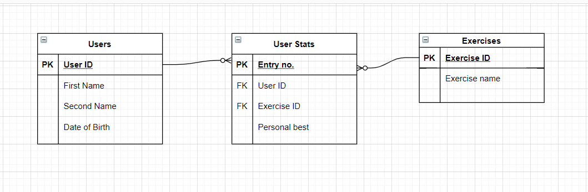
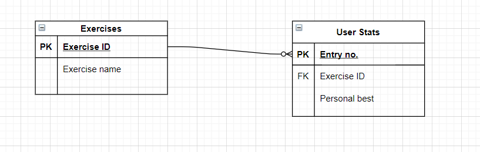
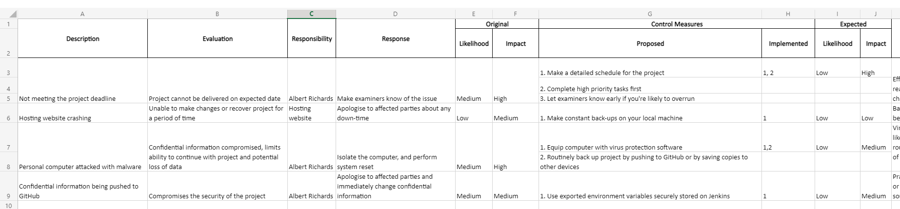

# QA Fundamental Project 1

## Contents
* [Introduction](#introduction)
* [Architecture](#architecture)
    * [Evolution of Project Design](#evolution-of-project-design)
    * [Kanban Board](#kanban-board)
    * [Risk Assessment](#risk-assessment)
* [Developement and Deployment](#developement-and-deployment)
    * [Test Reports](#test-report)
    * [Continuous Integration](#continuous-integration)

## Introduction

The project objective was as follows:
> To create a CRUD application with utilisation of supporting tools, methodologies and technologies that encapsulate all core modules covered during training.
It was also mentioned that there should be a relational database containing a minimum of two tables with a relationship between them. 

For this project I decided to create a webapp that stores and displays a users' personal records for a number of exercises that one performs in the gym.

## Architecture

### Evolution of Project Design 
The scope of the project was reviewed and narrowed several times over the projects' duration. 

My original design for the entity relation diagram (ERD) for my database:

Originally I had intended the app to feature the option for a user to add exercises to the database. I decided against this due to the time constraints involved in implementing such a feature and so added the exercises into the exercise table as static data.

Another feature I originally wanted to incorporate was a users table which let multiple users store, view, update and delete their gym records. This idea was axed for similar reasons, namely time concerns. 

The new ERD for my project ended up looking like this:

### Kanban Board

I chose [Trello](https://trello.com) to create my Kanban board and hence to plan my project due to it being free and that I was already familiar with the app.

A screenshot of my Trello board:

![trello_board]

My full Trello board can be accessed [here]().

### Risk Assessment 

Screenshot of my risk assessment:

Full risk assessment available [here](https://onedrive.live.com/edit.aspx?resid=2999F3BD7781D9A6!127&ithint=file%2cxlsx&wdOrigin=OFFICECOM-WEB.START.MRU).

## Developement and Deployment

